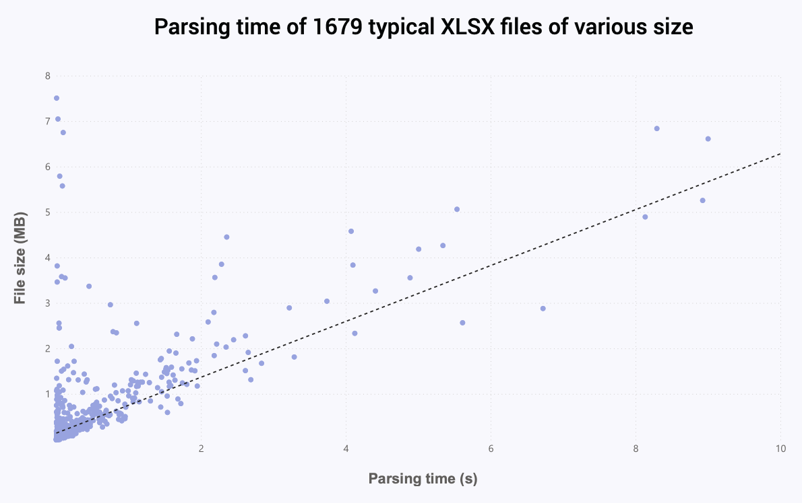

High performance is one of the goals for Spreadsheet Viewer. To deliver high performance consistently, we have developed a tool for performance analysis and keep track of how any code change affects performance.

⚠️ Due to modern CPU and V8 optimizations, and the cloud servers used by GitHub Actions, there is a very big standard error observed when running performance measurements. **Measurements of the same code can vary up to 20%**, so it is not advised to follow the performance readings literally.

## Process

Whenever possible, every code change in our repos should **improve** the performance or keep it at the same level. 

To measure our current performance, we created a tool that reports various performance metrics. Current metrics (all readings in miliseconds, unless stated otherwise):

- `parser` - total duration of parsing, including `parserPreparing`, `parserReading`, `parserFixing`
- `parserPreparing` - time spent preparing configuration for SheetJS
- `parserReading` - time spent executing SheetJS
- `parserFixing` - time spent fixing the SheetJS result to our needs
- `interpreter` - total duration of creating input for presentation, including `interpreterCss` and `interpreterHotConfig`
- `interpreterCss` - time spent generating the CSS stylesheet definition
- `interpreterHotConfig` - time spent generating the Handsontable configuration
- `presentation` - total duration of presentation. Warning: it is not a sum of other presentation metrics
- `presentationTabsParsing` - time spent creating the configuration for the Tabs component
- `presentationTabsRendering` - time spent rendering the configuration for the Tabs component in React
- `presentationHotRendering` - time spent rendering the HotTable component in React
- `Nodes` - Number of DOM nodes in the page.
- `LayoutDuration` - Combined durations of all page layouts. 
- `RecalcStyleDuration` - Combined duration of all page style recalculations. 
- `ScriptDuration` - Combined duration of JavaScript execution. 
- `JSHeapUsedSize` - Used JavaScript heap size. 
- `firstPaint` - time when the browser first rendered anything that is visually different from what was on the screen prior to navigation.
- `firstContentfulPaint` - time when the browser first rendered any text, image (including background images), non-white canvas or SVG.
- JS bundle size - not included in CSV report, reported it in workflow section `File size reports` stdout
- CSS bundle size - not included in CSV report, reported it in workflow section `File size reports` stdout

### Automatic benchmark

Each time when branch is pushed, there is a `perf` workflow, that can run on GitHub Actions. This workflow runs automatically if the commit message contains the word `perf`.

The `perf` workflow compares performance measured on the current branch to performance measured on `develop` branch.

To review the performance of a PR, it is enough to look at the report of the last GitHub Actions build that initiated this workflow.

### Manual benchmark

You can manually execute performance measurements in your local environment by executing the following code:

```bash
NODE_ENV=staging yarn build:sv && yarn serve:sv
# Then in another terminal window
yarn perf
```

## Tool

The process explained above uses a custom performance tool that can be used in CLI. The performance tool runs the app in Puppeteer and measures various metrics about the performance.

The tool requires the app to be started using `yarn start:perf`, which makes a near-production build that includes performance markers and starts the HTTP server.

### Commands

```
yarn perf
```
Runs all scenarios defined in config (more on that in config section). Displays aggregated result in CLI.


```
yarn perf --output=file.csv
```
Same as `yarn perf`, but at the end, it saves unaggregated results to `/perf/reports/generated/file.csv`.

The CSV file can be used to visualize all readings on a scatter plot in Excel:



```
yarn perf --compare=file.csv
```
Same as `yarn perf`, but at the end, it loads results from `/perf/reports/generated/file.csv` and compares it to results from current run. Displays aggregated comparison in CLI.

### Config

All commands above use one config object, which is defined under `/perf/config.ts`

- `appAddress` - The URL to SV frame at which the performance measurement will be executed. 
- `statistic` - Mathematical function which should be used to calculate measurement results. Currently we are using `median`.
- `numberOfSamples` - Defines how many times one scenario will be repeated.
- `appMarkers` - List of application performance markers which should be included in report. If marker is not created in application (using `startPerfMarker`, `endPerfMarker` helper functions) then performance measurement will bail out with error information.
- `browserMarkers` - Similar to `appMarkers` but it's a list of browser performance markers. These are always available, so nothing else has to be added to code if we want to change these markers.
- `scenarios` - List of scenarios to execute. The only scenario assumption is that it opens browser on `appAddress` in a new tab. Inside scenario, You can execute any Puppeteer script. 

### Customization

It is possible to add custom metrics using either:
- helper functions `startPerfMarker('myname')` and `endPerfMarker('myname')`
- native functions `performance.mark('mynameStart')` and `performance.mark('mynameEnd')`

The above calls are equivalent. They result in adding a new metric `myname` to the reports. Note: for `--compare` report, the same metrics must be present in both test runs, otherwise an error is thrown.